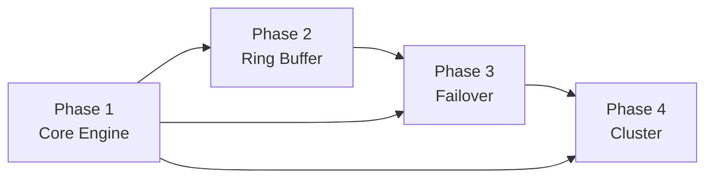

# Kervan — Implementation Plan

**Version:** 0.1.0-draft  
**Status:** Authoritative Roadmap  
**Last Updated:** 2026-06-11  
**Derived From:** [Technical Design Document](../technical-design-document.md), [Architectural Decision Records](../architectural-decision-records.md)

---

## Overview

This directory contains the phased implementation roadmap for Kervan v0.1. Each phase builds on the prior layer and must satisfy its **Definition of Done** before the next phase begins. Phases are ordered to de-risk the highest-complexity subsystems first (I/O + session locality) before layering buffering, failover, and cluster coordination.

```
Phase 1 ──▶ Phase 2 ──▶ Phase 3 ──▶ Phase 4
 Core         Ring         Failover      Cluster
 Engine       Buffer       Routing       Topology
```

| Phase | Document | One-Line Objective |
|-------|----------|-------------------|
| **1** | [phase-1-core-engine.md](./phase-1-core-engine.md) | Event-driven NetPoller + sharded SessionManager accepting 10k+ TCP/WebSocket client connections with zero goroutine-per-connection |
| **2** | [phase-2-ring-buffer.md](./phase-2-ring-buffer.md) | Per-session bounded FIFO ring buffer with sync.Pool byte reuse and configurable backpressure policies |
| **3** | [phase-3-failover-routing.md](./phase-3-failover-routing.md) | TargetRegistry health probing, consistent-hash routing, and Freeze/Thaw failover lifecycle |
| **4** | [phase-4-distributed-cluster.md](./phase-4-distributed-cluster.md) | External coordination store integration, session leases, routing epoch, and horizontal cluster deployment |

---

## Global Prerequisites (Before Phase 1)

| Item | Requirement |
|------|-------------|
| Go toolchain | ≥ 1.22 (for `clear`, improved `sync/atomic` ergonomics) |
| Module path | `github.com/ysBayram/kervan` (adjust to actual org) |
| CI baseline | `go test -race ./...`, `golangci-lint`, allocation gate on benchmarks |
| Target platforms | `linux/amd64`, `linux/arm64` (primary); `darwin/arm64` (dev/kqueue) |

---

## Cross-Phase Invariants

These invariants apply to **all** phases and must not be violated by any PR:

1. **No goroutine-per-connection** — sessions are fds registered with NetPoller.
2. **Single-writer per session** — ring buffer and session state mutations occur on the NetPoller worker that owns the fd.
3. **Payload locality** — inbound bytes never leave the owning node (Phase 4 store holds metadata only).
4. **Hot-path zero allocation** — steady-state read/write loops must benchmark to `0 allocs/op` before phase sign-off.
5. **Atomic session state** — `ClientSession.State` transitions use `atomic.Uint32` CAS, never mutex on hot path.

---

## Phase Dependency Graph



- Phase 3 depends on Phase 1 (NetPoller, SessionManager) and Phase 2 (RingBuffer, FlushScheduler stub).
- Phase 4 depends on Phase 3 (TargetRegistry publishes health) and Phase 1 (node identity, session lifecycle).

---

## Estimated Timeline (Guidance)

| Phase | Engineering Effort | Parallel Workstreams |
|-------|-------------------|---------------------|
| Phase 1 | 3–4 weeks | NetPoller (Linux first), SessionManager, WS handshake |
| Phase 2 | 2–3 weeks | Buffer pools, backpressure, flush scheduler |
| Phase 3 | 3–4 weeks | Health probes, routing, Freeze/Thaw FSM |
| Phase 4 | 2–3 weeks | etcd adapter, lease manager, K8s manifests |

---

*Each phase document is self-contained and includes Objective, Directory Layout, Coding Roadmap, Performance Bounds, Testing Criteria, and Definition of Done.*
