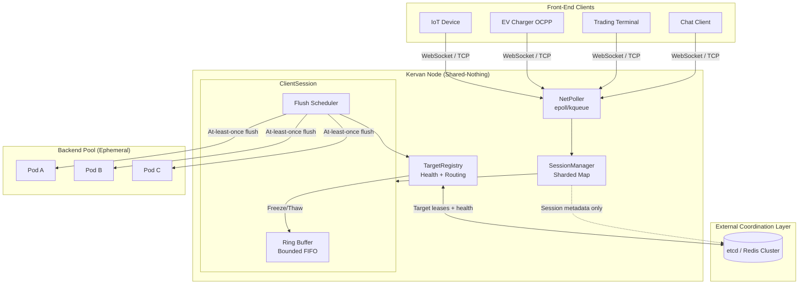
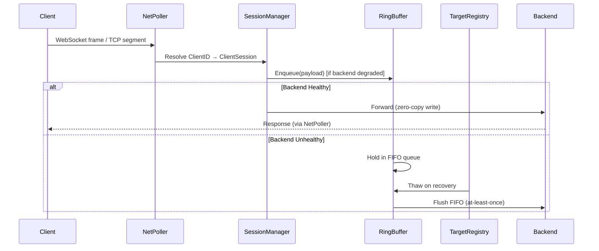
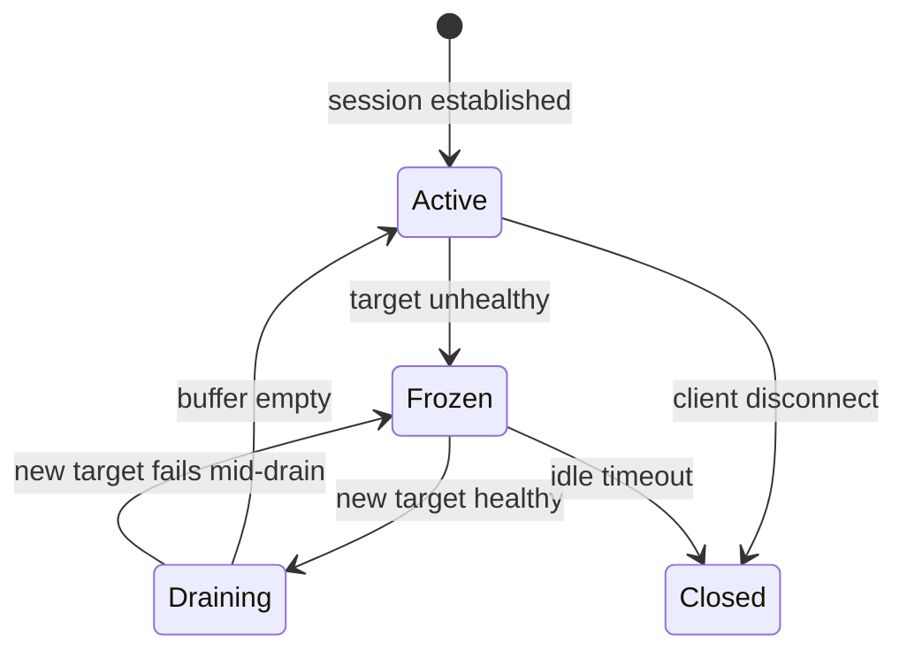

# Kervan — Technical Design Document

**Version:** 0.1.0-draft  
**Status:** Source of Truth (Bootstrap)  
**Last Updated:** 2026-06-11  
**Authors:** Kervan Core Team

---

## Dedication — The Caravanserai Philosophy

Across the ancient Silk Road, trade did not flow in a single uninterrupted stream. Merchants traveled through deserts, mountain passes, and contested territories where storms, bandits, and collapsed bridges could sever a route at any moment. Yet the cargo—spices, silk, coin—could not be abandoned. **Caravanserais** (*kervansaray* in Turkish) were fortified waystations built at regular intervals along these routes: walled enclosures where a caravan could halt, shelter its goods, rest its animals, and wait until the path ahead was safe again.

**Kervan** draws its name from the caravan (*kervan*) and the sanctuary (*serai*) that protected it. In this system, each client payload is cargo of intrinsic value—an OCPP command, a financial tick, a chat message, an IoT telemetry frame. The upstream backend is the distant market; the network between them is unpredictable terrain. When a backend pod crashes, a rolling update severs the route, or latency spikes into degradation, a conventional reverse proxy drops the client connection and the cargo is lost.

Kervan refuses that trade-off. It is the caravanserai at the edge: a stateful, connection-resilient Layer 7 proxy that holds cargo in a bounded, zero-copy ring buffer until the route to the destination is restored, then flushes it in strict FIFO order with at-least-once delivery. The front-end connection—the bond between client and proxy—is sacred and must survive every storm the backend endures.

---

## Table of Contents

1. [Executive Summary](#1-executive-summary)
2. [Goals and Non-Goals](#2-goals-and-non-goals)
3. [System Architecture](#3-system-architecture)
4. [Core Components](#4-core-components)
5. [Data Structures](#5-data-structures)
6. [Failover Lifecycle](#6-failover-lifecycle)
7. [Memory and I/O Optimization](#7-memory-and-io-optimization)
8. [Protocol Support](#8-protocol-support)
9. [Operational Model](#9-operational-model)
10. [Performance Targets](#10-performance-targets)
11. [Security Considerations](#11-security-considerations)
12. [Future Work](#12-future-work)

---

## 1. Executive Summary

Kervan is a connection-resilient, stateful Layer 7 WebSocket/TCP proxy designed for environments requiring **10,000+ concurrent stateful connections** with sub-millisecond steady-state overhead. It sits between front-end clients (IoT devices, EV chargers, trading terminals, chat clients) and ephemeral backend microservices, absorbing upstream failures without severing downstream sessions.

The system is built on four pillars:

| Pillar | Mechanism |
|--------|-----------|
| **Connection Immutability** | Client-facing TCP/WebSocket sessions outlive backend target churn |
| **Bounded Buffering** | Per-client ring buffers with explicit backpressure policies |
| **Shared-Nothing Locality** | Session state colocated with the connection; external store for coordination only |
| **Zero-Allocation Hot Path** | `sync.Pool`, slab allocation, and event-driven I/O to minimize GC pressure |

---

## 2. Goals and Non-Goals

### 2.1 Goals

- Maintain client connections through backend pod death, rolling updates, and network partitions (within configured timeout windows).
- Buffer inbound client payloads in a bounded, per-session FIFO queue during upstream unavailability.
- Deliver buffered payloads in strict FIFO order with **at-least-once** semantics upon backend recovery.
- Scale horizontally to 10k+ concurrent sessions per node with predictable memory footprint.
- Support WebSocket (RFC 6455) and raw TCP byte-stream proxying at Layer 7.
- Expose health, queue depth, and failover state via Prometheus metrics and structured logs.

### 2.2 Non-Goals (v0.1)

- Exactly-once delivery across process restarts (requires durable persistence; deferred).
- TLS termination (delegated to upstream ingress or sidecar in initial release).
- Application-layer message transformation or protocol conversion.
- Built-in authentication/authorization (assumed upstream of Kervan or at ingress).

---

## 3. System Architecture

### 3.1 High-Level Topology



### 3.2 Request Flow (Steady State)



### 3.3 ASCII Architecture (Deployment View)

```
┌─────────────────────────────────────────────────────────────────────────┐
│                           Kervan Node                                   │
│  ┌──────────────┐   ┌─────────────────┐   ┌──────────────────────────┐  │
│  │  NetPoller   │──▶│ SessionManager  │──▶│  ClientSession (×N)      │  │
│  │ (epoll/kqueue│   │ 256 shards      │   │  ┌────────────────────┐  │  │
│  │  edge-trigger│   │ FNV-1a hash     │   │  │ RingBuffer (bound) │  │  │
│  │  )           │◀──│ ClientID→Session│◀──│  │ FlushScheduler     │  │  │
│  └──────────────┘   └────────┬────────┘   │  └────────────────────┘  │  │
│                              │             └──────────────────────────┘  │
│                              ▼                                           │
│                    ┌─────────────────┐                                   │
│                    │ TargetRegistry  │◀──── etcd / Redis (leases)       │
│                    │ Health probes   │                                   │
│                    │ Freeze / Thaw   │                                   │
│                    └────────┬────────┘                                   │
└─────────────────────────────┼────────────────────────────────────────────┘
                              ▼
                    ┌─────────────────┐
                    │ Backend Targets │
                    │ (K8s Endpoints) │
                    └─────────────────┘
```

---

## 4. Core Components

### 4.1 SessionManager

The SessionManager is the authoritative in-process registry mapping **ClientID → ClientSession**. At 10k+ connections, a single `sync.RWMutex`-guarded map becomes a serial bottleneck. Kervan uses a **sharded concurrent map** architecture.

#### 4.1.1 Sharding Strategy

```
shardCount = 256  (configurable, power of two)
shardIndex = fnv32a(clientID) & (shardCount - 1)
```

Each shard owns:

```go
type shard struct {
    mu       sync.RWMutex
    sessions map[string]*ClientSession  // ClientID → session
}
```

- **Read path** (message arrival): hash → shard RLock → lookup → RUnlock. No cross-shard coordination.
- **Write path** (session create/destroy): hash → shard Lock → insert/delete → Unlock.
- **Rebalancing**: not required; ClientID affinity is stable for session lifetime.

#### 4.1.2 ClientSession Lifecycle

```
                    ┌─────────────┐
         connect    │   CREATED   │
        ──────────▶ │  (handshake)│
                    └──────┬──────┘
                           │ ClientID assigned, ring buffer allocated
                           ▼
                    ┌─────────────┐
                    │   ACTIVE    │◀────┐
                    │  (streaming)│     │ backend recovered
                    └──────┬──────┘     │
                           │ upstream   │
                           │ failure    │
                           ▼            │
                    ┌─────────────┐     │
                    │   FROZEN    │─────┘
                    │ (buffering) │
                    └──────┬──────┘
                           │ client disconnect OR
                           │ idle timeout exceeded
                           ▼
                    ┌─────────────┐
                    │  TERMINATED │
                    └─────────────┘
```

Each `ClientSession` encapsulates:

| Field | Purpose |
|-------|---------|
| `ClientID` | Stable identifier (from handshake token, device serial, or generated UUID) |
| `Conn` | Opaque handle to NetPoller-registered file descriptor |
| `RingBuffer` | Bounded inbound queue |
| `State` | `Active`, `Frozen`, `Draining`, `Closed` (atomic uint32) |
| `TargetID` | Currently bound backend target |
| `CreatedAt`, `LastActivity` | For idle eviction |
| `Metrics` | Per-session counters (enqueued, dropped, flushed, bytes) |

#### 4.1.3 Concurrency Invariants

1. A ClientSession is **owned by exactly one shard** for its entire lifetime.
2. Ring buffer mutations occur on the **NetPoller goroutine** for that fd (single-writer per session).
3. Cross-component signals (Freeze/Thaw) use **lock-free atomic state transitions** plus a buffered channel wake-up to the NetPoller.

---

### 4.2 In-Memory Ring Buffer (Bounded Queue)

Each ClientSession owns a fixed-capacity ring buffer. The buffer is the caravanserai: cargo enters at the tail, exits at the head, and the walls (capacity bound) prevent unbounded memory growth.

#### 4.2.1 Memory Layout

Kervan uses a **slab-backed ring buffer** rather than a linked list of individually allocated `[]byte` slices:

```
┌──────────────────────────────────────────────────────────────┐
│ RingBuffer                                                    │
│  capacity: uint32          (max entries)                      │
│  maxBytes:  uint64         (max total payload bytes)          │
│  head:      atomic.Uint32  (consumer index)                   │
│  tail:      atomic.Uint32  (producer index)                   │
│  count:     atomic.Uint32  (current occupancy)                │
│  entries:   []RingEntry    (pre-allocated slab)               │
│  pool:      *sync.Pool     (byte slice reuse)                 │
└──────────────────────────────────────────────────────────────┘

RingEntry {
    offset   uint32   // index into pooled byte slab OR inline [N]byte
    length   uint32
    seqNum   uint64   // monotonic sequence for at-least-once dedup hints
    enqueued int64    // unix nano, for observability
}
```

For payloads ≤ **InlineThreshold** (default 256 bytes), data is stored inline in `RingEntry` to avoid pool fetch. Larger payloads borrow from `sync.Pool` via power-of-two size classes (256, 512, 1K, 2K, 4K, 8K, 16K).

#### 4.2.2 Backpressure Strategies

When the ring buffer reaches capacity, behavior is **explicitly configured per route/tenant**:

| Policy | Behavior | Use Case |
|--------|----------|----------|
| **DropOldest** | Evict head entry, enqueue new payload at tail | IoT telemetry where freshness > completeness |
| **Reject** | Return error to client immediately (WS close code 1013 / TCP RST policy configurable) | Financial commands where loss must be visible |
| **Block** | Spin-wait or park producer up to `BlockTimeout` | Chat engines where ordering and completeness dominate |

```go
type BackpressurePolicy int

const (
    DropOldest BackpressurePolicy = iota
    Reject
    Block
)
```

**DropOldest** implementation uses a single CAS loop on `head` and `count`; the evicted entry's byte slab is returned to `sync.Pool`. Metrics increment `kervan_buffer_dropped_total{policy="drop_oldest"}`.

**Block** parks the producer by registering the session fd with the NetPoller in **read-disabled** mode until `count < capacity` or `BlockTimeout` fires (then escalates to Reject).

#### 4.2.3 FIFO and At-Least-Once Semantics

- **FIFO**: Single producer (client read loop), single consumer (flush loop) per session guarantees strict ordering without additional synchronization beyond atomics on head/tail.
- **At-least-once**: Each `RingEntry` carries a monotonic `seqNum`. On flush, Kervan writes payloads sequentially and waits for TCP ACK (or WebSocket write completion) before advancing `head`. If the backend connection drops mid-flush, the session transitions to `Frozen`; un-ACKed entries remain at the head and are retried on the next healthy target. Backends **may** deduplicate via `seqNum` header (optional contract).

---

### 4.3 TargetRegistry

The TargetRegistry monitors upstream backend health, manages dynamic routing, and orchestrates the **Freeze/Thaw** mechanism on client queues during failover events.

#### 4.3.1 Responsibilities

1. **Discovery**: Watch Kubernetes Endpoints, Consul catalog, or static config file for backend target changes.
2. **Health Probing**: Active probes (TCP connect, HTTP `/health`, WebSocket ping) and passive observation (write error rates from flush loop).
3. **Routing**: Map `(route, ClientID)` → `TargetID` using consistent hashing with bounded load.
4. **Failover Coordination**: Emit Freeze/Thaw signals to affected ClientSessions.

#### 4.3.2 Target State Machine

```
    ┌──────────┐  probe OK   ┌──────────┐
    │ UNKNOWN  │────────────▶│ HEALTHY  │
    └──────────┘             └────┬─────┘
          ▲                       │ probe fail × N
          │                       ▼
          │                  ┌──────────┐
          └──── probe OK ────│ UNHEALTHY│
                             └──────────┘
```

#### 4.3.3 Freeze / Thaw Protocol

**Freeze** (backend becomes unhealthy):

1. TargetRegistry marks target `UNHEALTHY` in local cache and publishes state to coordination store.
2. For each session bound to that target, atomically CAS `Active → Frozen`.
3. Subsequent client payloads route to the session's RingBuffer instead of the backend socket.
4. Backend fd is deregistered from NetPoller; no further writes attempted.

**Thaw** (replacement target healthy):

1. TargetRegistry selects new target via consistent hash (may differ from original pod).
2. Establish new backend connection via NetPoller.
3. CAS `Frozen → Draining`.
4. FlushScheduler drains RingBuffer head→tail in order to new backend.
5. On drain complete, CAS `Draining → Active`; live traffic resumes direct forwarding.



#### 4.3.4 Coordination Store Interface

Session **payload data never leaves the node**. The external store holds only:

- Target health records (TTL-bound)
- Session routing hints for cross-node handoff (optional, future)
- Distributed locks for target assignment during scale events

```go
type CoordinationStore interface {
    RegisterTarget(ctx context.Context, target Target) error
    WatchTargets(ctx context.Context) (<-chan TargetEvent, error)
    AcquireSessionLease(ctx context.Context, clientID string, ttl time.Duration) (Lease, error)
}
```

---

## 5. Data Structures

### 5.1 Size Class Pool

```go
var bytePools = [...]*sync.Pool{
    newPool(256),
    newPool(512),
    newPool(1024),
    // ... up to MaxFrameSize
}

func acquireBuffer(size int) []byte {
    class := sizeClass(size)
    return bytePools[class].Get().([]byte)[:size]
}

func releaseBuffer(buf []byte) {
    class := sizeClass(cap(buf))
    bytePools[class].Put(buf[:cap(buf)])
}
```

### 5.2 SessionManager Top-Level

```go
type SessionManager struct {
    shards    [256]*shard
    shardMask uint32 // 255
    config    SessionConfig
    metrics   *SessionMetrics
}

func (sm *SessionManager) Get(clientID string) (*ClientSession, bool) {
    s := sm.shards[hash(clientID)&sm.shardMask]
    s.mu.RLock()
    defer s.mu.RUnlock()
    sess, ok := s.sessions[clientID]
    return sess, ok
}
```

### 5.3 NetPoller Event Model

```go
type PollerEvent struct {
    FD     int32
    Op     PollOp  // Read, Write, ReadWrite
    Session *ClientSession
}

type NetPoller struct {
    epfd      int           // epoll fd (Linux) or kqueue fd (BSD/macOS)
    events    []EpollEvent  // pre-allocated batch buffer
    sessionPool sync.Pool   // reuse PollerEvent wrappers
}
```

---

## 6. Failover Lifecycle

### 6.1 Scenario: Rolling Update (Kubernetes)

| Phase | Client Connection | Backend Connection | Ring Buffer |
|-------|-------------------|--------------------|-------------|
| T0: Steady state | Open | Pod-A | Empty |
| T1: Pod-A SIGTERM | Open | Pod-A draining | Empty |
| T2: Pod-A terminated | Open | **Closed** | **Frozen**, accepting payloads |
| T3: Pod-B ready | Open | Pod-B connected | Draining (FIFO flush) |
| T4: Flush complete | Open | Pod-B active | Empty, direct proxy |

**Client observes**: continuous WebSocket/TCP session; may see increased latency during T2–T4 but no disconnect.

### 6.2 Scenario: Network Partition (Backend Isolated)

1. Passive health: flush loop write errors exceed threshold within `ErrorRateWindow`.
2. TargetRegistry marks target unhealthy before probe timeout (fast path).
3. Freeze activates; buffer accumulates client traffic.
4. Partition heals; Thaw selects same or new pod; at-least-once flush.

### 6.3 Scenario: Kervan Node Failure

Client connection drops (unavoidable without external connection migration). Session state on the failed node is lost. **Mitigation** (future): session handoff via coordination store + client reconnect with resume token; durable spill-to-disk for critical tenants.

### 6.4 Timing Parameters (Defaults)

| Parameter | Default | Description |
|-----------|---------|-------------|
| `ProbeInterval` | 2s | Active health check period |
| `UnhealthyThreshold` | 3 | Consecutive failures before Freeze |
| `HealthyThreshold` | 2 | Consecutive successes before Thaw |
| `MaxFreezeDuration` | 5m | Force client disconnect if backend unavailable |
| `DrainTimeout` | 30s | Max time to flush buffer on Thaw |
| `IdleSessionTimeout` | 15m | Evict inactive sessions |

---

## 7. Memory and I/O Optimization

### 7.1 Design Principles

1. **No goroutine-per-connection**: A small, fixed pool of worker goroutines services the NetPoller. Each epoll/kqueue wait batch may dispatch hundreds of ready fds. Target: ≤ `GOMAXPROCS + 2` long-lived goroutines for I/O on the hot path.
2. **Zero-copy where possible**: Use `sendfile`, `splice` (Linux), or `writev` with pooled buffers. Avoid `[]byte` ↔ `string` conversions.
3. **Allocation-free hot path**: Steady-state proxying (healthy backend) allocates **zero heap objects** per frame.
4. **GC-neutral buffer lifecycle**: All frame buffers originate from and return to `sync.Pool`; ring buffer slabs are allocated once at session creation.

### 7.2 NetPoller Architecture

Kervan abstracts OS-specific event notification:

| Platform | Backend | Mode |
|----------|---------|------|
| Linux | `epoll` (via `golang.org/x/sys/unix`) | Edge-triggered (`EPOLLET`) |
| macOS / BSD | `kqueue` | Edge-triggered (`EV_CLEAR`) |
| Fallback | `poll` / Go netpoller integration | Level-triggered |

**Edge-triggered discipline**: After `EAGAIN` on read/write, re-arm the fd interest mask. Prevents thundering herd while maintaining wake-up correctness.

### 7.3 Goroutine Budget

| Component | Goroutines | Notes |
|-----------|------------|-------|
| NetPoller workers | `GOMAXPROCS` | One epoll/kqueue loop per P |
| TargetRegistry | 1 + N probes | Probe workers from bounded pool |
| Metrics exporter | 1 | Prometheus scrape handler |
| Admin API | 1 | Health, config reload |
| **Per connection** | **0** | Sessions are fds, not goroutines |

### 7.4 Memory Footprint Estimation

Per session (defaults: 1024 entries × 2 KB average payload):

```
RingBuffer slab:     1024 × (RingEntry ~32B + avg payload 2KB) ≈ 2 MB
Session metadata:    ~512 B
NetPoller fd state:  ~256 B
─────────────────────────────────
Total per session:   ~2 MB (configurable via capacity × maxBytes)
10k sessions:        ~20 GB upper bound (tenant must tune capacity)
```

Operators configure `maxEntries` and `maxBytes` per route to cap footprint.

### 7.5 GC Tuning Guidance

- Set `GOGC=off` with a manual ballast or use `GOMEMLIMIT` to cap RSS (Go 1.19+).
- Prefer **fewer, larger pool size classes** over many small ones to reduce pool shard overhead.
- Export `go_gc_duration_seconds` and `kervan_pool_hit_ratio` for capacity planning.

---

## 8. Protocol Support

### 8.1 WebSocket (RFC 6455)

- Full duplex; client→backend and backend→client paths are independently managed.
- **Client→backend buffering** applies during Freeze (primary use case).
- **Backend→client**: best-effort forward; no buffering on backend failure (client already holds connection state). Optional future: server-push buffer.
- Frame defragmentation occurs in-place within pooled buffers; masking handled on read.

### 8.2 Raw TCP

- Byte-stream semantics; no message boundary preservation beyond what the ring buffer entry defines (one read syscall batch = one entry by default, configurable delimiting for length-prefixed protocols like OCPP-J).

### 8.3 OCPP Considerations

OCPP 1.6J over WebSocket expects call ordering. Kervan's per-session FIFO directly satisfies CALL message ordering during charger backend failover.

---

## 9. Operational Model

### 9.1 Configuration

YAML/TOML config with hot-reload for non-structural changes (backpressure policy, probe intervals). Structural changes (bind address, shard count) require restart.

### 9.2 Metrics (Prometheus)

| Metric | Type | Description |
|--------|------|-------------|
| `kervan_sessions_active` | Gauge | Current active sessions |
| `kervan_sessions_frozen` | Gauge | Sessions in Frozen state |
| `kervan_buffer_depth` | Histogram | Ring buffer occupancy |
| `kervan_buffer_dropped_total` | Counter | Payloads dropped by backpressure |
| `kervan_flush_total` | Counter | Payloads flushed to backend |
| `kervan_flush_latency_seconds` | Histogram | Time from enqueue to successful backend write |
| `kervan_target_health` | Gauge | Per-target health (1=healthy) |
| `kervan_pool_hit_ratio` | Gauge | sync.Pool reuse effectiveness |

### 9.3 Deployment

- **Recommended**: Kubernetes DaemonSet or dedicated Deployment with `hostNetwork: true` for low-latency epoll at scale.
- **Horizontal scaling**: Shared-nothing; load balancer sticky on ClientID / connection (L4 affinity).
- **Coordination**: etcd or Redis Cluster as managed service.

---

## 10. Performance Targets

| Metric | Target (single node, 16 vCPU) |
|--------|-------------------------------|
| Concurrent sessions | ≥ 10,000 |
| Steady-state p99 latency overhead | ≤ 500 µs |
| Failover detection | ≤ 6s (default probes) |
| GC pause p99 | ≤ 1 ms (with pool tuning) |
| Memory per session | Operator-configured, default ≤ 2 MB |

---

## 11. Security Considerations

- **Resource exhaustion**: Bounded ring buffers + session limits per IP/token prevent slowloris-style memory attacks.
- **Tenant isolation**: Separate buffer quotas per route/API key.
- **Coordination store ACLs**: Least-privilege access for lease operations.
- **No payload inspection by default**: Kervan is a transparent byte pipe; TLS end-to-end passthrough preserves confidentiality.

---

## 12. Future Work

- Durable buffer spill (mmap WAL) for process-survivable at-least-once.
- QUIC / HTTP/3 WebSocket transport (RFC 9220 maturity dependent).
- eBPF-based passive health observation.
- Cross-node session migration with client-visible resume token.
- WASM plugin hooks for opt-in payload inspection.

---

## Appendix A — Glossary

| Term | Definition |
|------|------------|
| **Freeze** | Suspend backend forwarding; enqueue to ring buffer |
| **Thaw** | Resume backend forwarding; drain ring buffer FIFO |
| **ClientID** | Stable session identifier for routing and affinity |
| **Target** | A single upstream backend instance (IP:port or pod) |
| **At-least-once** | Payload delivered one or more times; idempotency is consumer responsibility |

---

## Appendix B — References

- [RFC 6455 — The WebSocket Protocol](https://datatracker.ietf.org/doc/html/rfc6455)
- [OCPP 1.6 Specification — Open Charge Alliance](https://www.openchargealliance.org/)
- [Linux epoll(7)](https://man7.org/linux/man-pages/man7/epoll.7.html)
- [Go sync.Pool documentation](https://pkg.go.dev/sync#Pool)

---

*This document is the authoritative technical specification for Kervan v0.1. All implementation PRs must align with the invariants and lifecycles defined herein.*
